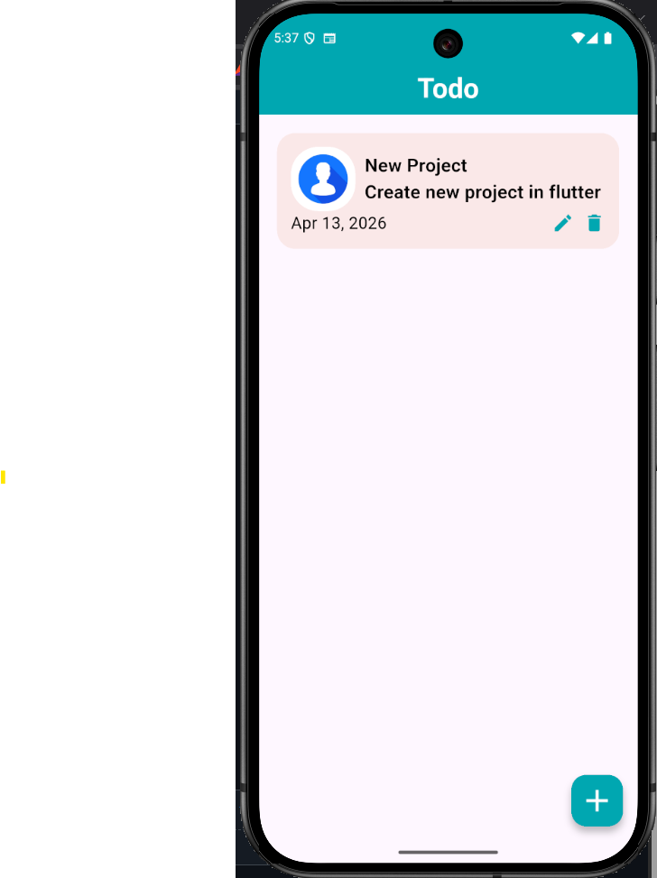

# 📝 Flutter Todo App (Bloc)

A simple and clean Todo application built using **Flutter**, implementing **Bloc State Management** and **Sqflite** for local database storage.

---

## 🚀 Features

* ➕ Add new tasks
* ✏️ Edit existing tasks
* 🗑️ Delete tasks
* 📅 Select and store task date
* 💾 Local storage using SQLite (Sqflite)
* 🔄 Reactive UI using Bloc

---

## 🏗️ Architecture

This project follows a structured approach:

* **UI Layer** → Screens (Flutter Widgets)
* **Bloc Layer** → Handles business logic and state
* **Database Layer** → Sqflite for local storage

```
UI → Event → Bloc → State → UI
```

---

## 📁 Folder Structure

```
lib/
├── bloc/
│   └── todo/
│       ├── todo_bloc.dart
│       ├── todo_event.dart
│       └── todo_state.dart
│
├── models/
│   └── todo_model.dart
│
├── services/
│   └── database.dart
│
├── views/
│   └── todo_ui_screen.dart
│
└── main.dart
```

---

## 🛠️ Tech Stack

* **Flutter**
* **Dart**
* **Bloc (flutter_bloc)**
* **Sqflite (SQLite database)**

---

## ▶️ Getting Started

### 1. Clone the repository

```
git clone https://github.com/vishalyadavv9/todoappwithstateblock.git
cd flutter-todo-bloc
```

### 2. Install dependencies

```
flutter pub get
```

### 3. Run the app

```
flutter run
```

---

## ⚠️ Important Note

If you face this error:

```
no column named date
```

Then delete the old database once:

* Uninstall the app
  **OR**
* Clear app data

This happens due to database schema update.

---

## 📸 Screenshots

## 📸 Screenshots

<p align="center">
  
</p>
---

## 📌 Future Improvements

* Dark Mode 🌙
* Firebase integration ☁️
* Notifications 🔔
* Clean Architecture (Repository Pattern)

---

## 🤝 Contributing

Feel free to fork this project and improve it.

---

## 👨‍💻 Author
 
GitHub: https://github.com/vishalyadavv9
---

## ⭐ If you like this project

Give it a star ⭐ on GitHub!
